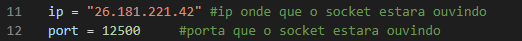

# Instalação #
1 - Instala [python](https://www.python.org/)
  
2 - Crie um ambiente virtual e inicie ele. [Mais informações](https://docs.python.org/3/library/venv.html)
  
      python3 -m venv /path/to/new/virtual/environment
      /path/to/new/virtual/environment\Scripts\activate

    
3 - Instale os requesitos nescessarios no requirements.txt
  
      pip install -r requirements.txt
4 - alterar o IP e PORTA que serao usados    

É nescessario antes de começa o sistema altera o IP, e portas caso nescessario ou queria, que indica a localização da maquina do servidor
  

No BackEnd-Servidor no arquivo [server_dinamic_socket.py](https://github.com/denielfer/pbl-conectvidade-problema1/blob/main/BackEnd-Servidor/server_dinamic_socket.py), nas linhas 11 ( IP ) e 12 (Porta caso queira)

e caso deseje troca a porta da API no arquivo [API.py](https://github.com/denielfer/pbl-conectvidade-problema1/blob/main/BackEnd-Servidor/API.py) na linha 45, trocando a trocando o valor do argumento "port"

No FrontEnd é nescessario informa qual o ip e a porta, do BackEnd, no arquivo [FrontEnd-Monitor/receptor/socke_handler.py](https://github.com/denielfer/pbl-conectvidade-problema1/blob/main/FrontEnd-Monitor/receptor/socke_handler.py), nas linhas 7 ( IP ) e 8 ( Porta ), informando as portas que foram configuradas no servidor ( BackEnd )

No Sistema de Simulação é nescessario informa qual o ip e a porta, do BackEnd, no arquivo [Simulção-Gerador_dados/gerador/pacient_thread.py](https://github.com/denielfer/pbl-conectvidade-problema1/blob/main/Simul%C3%A7%C3%A3o-Gerador_dados/gerador/pacient_thread.py), nas linhas 7 ( IP ) e 8 ( Porta ), informando as portas que foram configuradas no servidor ( BackEnd )

  
5 - inicia sistemas

 Estes passos não precisam ser feitos na ordem aqui especificada
   
5.1 - inicia BackEnd-Servidor:
    
 Em um terminal inicio o sistema com:
      
    python3 .\BackEnd-Servidor\API.py

5.2 - inicia Simulção-Gerador_dados:
 Em um terminal inicio o sistema com: (colocando o ip no qual o server do projeto django vai fica em: "__my_ip__" e a porta em: "__porta__" )
    
    python3 .\Simulção-Gerador_dados\manage.py runserver __my_ip__:__porta__
   
      
5.3 - inicia FrontEnd-Monitor:
    
 Em um terminal inicio o sistema com: (colocando o ip no qual o server do projeto django vai fica em: "__my_ip__" e a porta em: "__porta__" )
    
    python3 .\FrontEnd-Monitor\manage.py runserver __my_ip__:__porta__
    
Recomendações: caso os sistemas não estejam em uma rede local pode se usar [Radmin VPN](https://www.radmin-vpn.com/br/), para windowns, ou abri pode abri as portas do roteador para que ele funcione na rede, a porta na qual a api esta usando no servidor, e assim o FrontEnd teria que conseguir os dados pelo request, no sistema do Frontend e no sistema de Simulção a porta na qual foi inicializada o sistema na linha do terminal, porem ainda assim seria nescessario que a maquina com o sistema de Simulção deve esta na mesma rede local que o BackEnd, pois a comunicação dos mesmos é feito atravez de sockets, para mais detalhes olhar o [Diagramas de Sistema](https://github.com/denielfer/pbl-conectvidade-problema1/blob/main/Diagramas%20do%20sistema.png).
