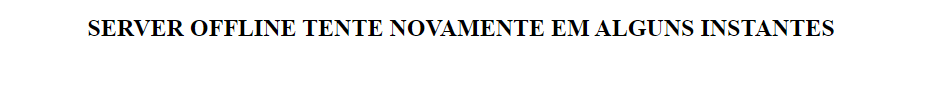

# Manual de usuario Gerador de dados #

Aqui presentaremos as paginas deste sistema, trazendo informações uteis para usuarios.

Ao abir a pagina desta aplicação o você pode ver 2 telas:

Esta caso o servidor ( BackEnd ) esteja fora do ar

Esta pagina informa que a tentativa de comunicação com o servidor BackEnd não obteve sucesso, ou ele esta fora do ar ou existe alguma falha na configuração ( a porta do servidor BackEnd nao esta correta ou o servidor esta fora do ar )

Esta pagina atualiza automaticamente a cada 1s para verificar se o BackEnd esta funcionando, caso não tenha controle sobre o Back não ha muito a se fazer. Caso seja quem esta configurando o Back verifique se os sockets foram informados corretamente, caso a maquina que contem este sistema nao esteja em uma rede local com a do Back garanta que as portas do Back estao abertas a todos.

Caso esteja tudo certo com a comunicação a tela que aparecera sera esta:

Aqui vemos que não existe pacientes registrados neste sistema ( note que ele nao importa os pacientes ja registrados no BackEnd apenas mostra os que foram criados atraves deste).

Para simular um dispositivo basta clicar no butao 'adicionar'

Ao aperta o botão a tela devera ser parecida com esta:

Nesta tela teremos uma tabela com os dispositivos do sistema.

Nesta tabela temos na primeira coluna o identificador do dispositivo, que consiste em uma string gerada aleatoriamente, e é usado para identificar o dispositivo no sistema. ( No sistema real este campo seria o nome do paciente, pois foi decidido que o nome do paciente seria o identificador do mesmo no sistema ).

Notas:  

- Os campos sao do tipo float com 2 casas de precisao, sendo limitada no sistema de geração, ou seja, pode ser usada uma maior precisao no sistema do BackEnd sendo esta limitação de 2 casas uma limitação escolhida para o simulador

Na segunda coluna temos o campo chamado 'pressão', que informa a pressão maxima medida pelo dispositivo naquele instante em milimetros de mercurio ( mmHg );

Na terceira temos o campo 'oxigenação', que informa a oxigenação do sangue medida pelo dispositivo naquele instante em porcentagem (%);

Na quarta temos o campo 'frequencia', que indica a frequencia respiratoria do paciente em movimetnos por minuto

Na quinta temos o campo 'temperatura' que indica a temperatura corporal medida pelo dispositivo no instante em ºC.

Os dados que são colocados nesta pagina serão analizado com base no que foi presentado nesta pagina [aqui](https://www.hospitaldaluz.pt/pt/guia-de-saude/saude-e-bem-estar/220/com-covid-19-a-que-estar-atento)

tambem cada paciente apresenta 2 botoes ao lado 'Editar' e 'remover':

O primeiro serve para envia as alterações feitas para o sistema, ou seja, apos editar os dados que simulam as leituras do sistema é nescessario precionar este botão para que o sistema atualize os dados que são enviados de forma periodica.

O segundo é o botao para o caso se deseje remover este dispositivo do sistema, o que além de remover deste sistema ira envia um pedido para que o BackEnd remova quele dispositivo do sistema, caso ao precinar este botão o paciente não seja removido da tabela isso quer dizer que houve um problema na comunicação com o servidor e o mesmo não foi removido do BackEnd

E por ultimo aqui temos um exemplo do sistema com 2 dispositvos, para mostra que o botao adiciona pode ser precionado quantas vezes for desejado para adiciona mais dispositivos ao sistema.

Estes disposistivos tem seus dados enviados a cada 1s para o BackEnd e caso haja uma falha de comunicação ele espera um tempo aleatorio entre 0 a 1s para tenta realiza o reenvio ( isso foi feito para evitar bust de envios no caso de mutiplas falha de envio)

