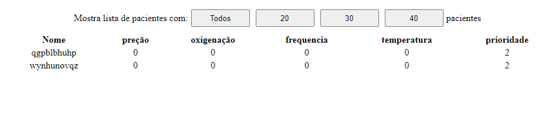

# Manual de Usuario - FrontEnd #

Neste arquivo daremos algumas informações sobre a aplicação de FrontEnd que sera usada pelo medico, informando sobre como algumas coisas funcionam e como usar esta aplicação.

Inicialmente ao abrir o site caso receba esta mensagem:

Isto quer dizer que o servidor BackEnd esta offline, então basta espera até que ele fique online ( a pagina atualiza automaticamente a cada 1s entao assim que o servidor estiver disponivel a tela ira mudar).

Caso seja quem esta configurando o Back verifique se os sockets foram informados corretamente, caso a maquina que contem este sistema nao esteja em uma rede local com a do Back garanta que as portas do Back estao abertas a todos.

Caso veja esta pagina:

Quer dizer que esta tudo funcionado corretametne. Pode ser que ao acessa essas paginas nao tenha nenhum paciente no momento, caso este seja o caso você vera apenas a parte superior para escolher quantos pacientes serão mostrados por vez e e os campos em negrito da imagem

Nela nos temos inicialmente, como falado anteriormente, uma linha que contem 4 botoes para que seja escolhidos quantos pacientes serão mostrados na tela ao mesmo tempo, 'Todos' mostrara todos os paciente no sistema, '20' mostrara os pacientes em paginas de 20 em 20, '30' de 30 em 30 e '40' de 40 em 40

lgbo abaixo temos o cabeçario da nossa tabela onde os dadso do paciente estarão sendo informados:

Na primeira coluna temos o campo 'Nome' que informa o identificador do paciente ( em um sistema real este campo estaria preencido com o nome do paciente, pois o nome seria usado como identificador no sistema, porém para a simulação esta sendo gerado uma string aleatoria de 10 caracteres para representar este campo )

Na segunda coluna temos o campo chamado 'pressão', que informa a pressão maxima medida pelo dispositivo naquele instante em milimetros de mercurio ( mmHg );

Na terceira temos o campo 'oxigenação', que informa a oxigenação do sangue medida pelo dispositivo naquele instante em porcentagem (%);

Na quarta temos o campo 'frequencia', que indica a frequencia respiratoria do paciente em movimetnos por minuto

Na quinta temos o campo 'temperatura' que indica a temperatura corporal medida pelo dispositivo no instante em ºC.

E entao a cada linha da tabela temos um paciente com suas respectivas informações sendo mostradas, como se pode ver na imagem apresentada acima.

É importante dizer que esta todas as paginas do sistema atualizam de 1s em 1s para tenta evitar que o medico esteja vendo informações muito antigas, assim na pagina que mostra todos os paciente ( caso haja um numero grande de pacientes ) a vizualização pode ser prejudicada, para tal foi feito a opção de mostra pacientes de x em x por pagina.

É poscivel também monitorar um unico paciente para isso basta clica na linha correspondente ao paciente desejado que sera aberto em uma nova aba os dados monitorados do mesmo  
